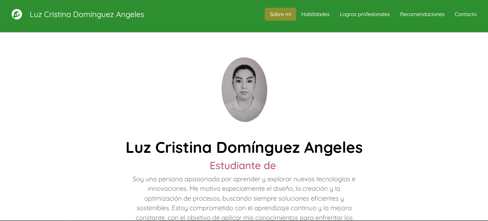

## Portafolio de Proyectos

Hola soy **Luz Cristina**, estudiante de **Ing. Mecánica**, me apasiona aprender nuevas cosas sobre la tecnología, aquí encontrarás información sobre mí.

____________________
### El proyecto cuenta con las secciones de:
-🔧 Habilidades 
- 🎖️Logros profesionales
-👩‍🦰Recomendaciones
-📞Contacto

### Creado con:
- HTML
- CSS
- JavaScript

    
    
    
### Vista previa
 

 ### *Espero pronto saber de ti*

 *Correo*
 [luzdomin.ing@gmail.com](mailto:luzdomin.ing@gmail.com)
 
 #### Creado en el bootcamp de TecnolochicasPro💜
 [Tecnolochicas](https://tecnolochicas.mx/)

